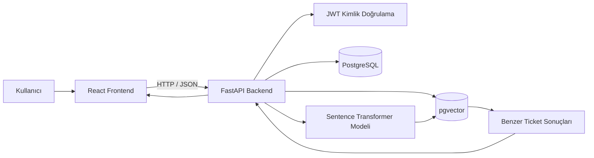
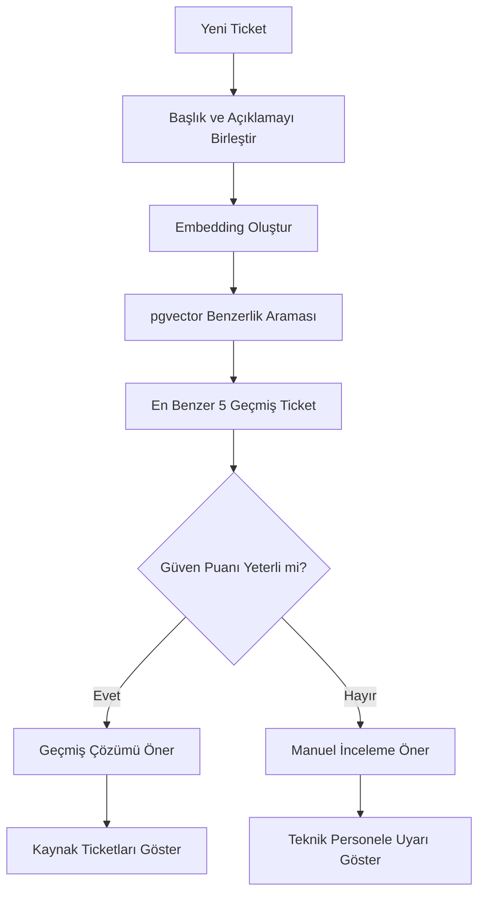

<div align="center">

# IntelliDesk

### Yapay Zekâ Destekli Service Desk ve Ticket Yönetim Sistemi

IntelliDesk; geçmiş Service Desk kayıtlarını, çözümleri ve vektör benzerliği yöntemini kullanarak yeni destek talepleri için çözüm önerileri üreten modern bir yardım masası uygulamasıdır.

[](https://www.python.org/)
[](https://fastapi.tiangolo.com/)
[](https://react.dev/)
[](https://www.postgresql.org/)
[](https://github.com/pgvector/pgvector)
[](https://jwt.io/)

</div>

---

## İçindekiler

- [Proje Hakkında](#proje-hakkında)
- [Çözülen Problem](#çözülen-problem)
- [Temel Özellikler](#temel-özellikler)
- [Sistem Mimarisi](#sistem-mimarisi)
- [RAG ve AI Öneri Sistemi](#rag-ve-ai-öneri-sistemi)
- [Kullanıcı Rolleri](#kullanıcı-rolleri)
- [Ticket İş Akışı](#ticket-iş-akışı)
- [Kullanılan Teknolojiler](#kullanılan-teknolojiler)
- [Proje Yapısı](#proje-yapısı)
- [Kurulum](#kurulum)
- [PostgreSQL ve pgvector Hazırlığı](#postgresql-ve-pgvector-hazırlığı)
- [Ortam Değişkenleri](#ortam-değişkenleri)
- [Veritabanı Migration İşlemleri](#veritabanı-migration-işlemleri)
- [Uygulamayı Çalıştırma](#uygulamayı-çalıştırma)
- [İlk Admin Hesabını Oluşturma](#ilk-admin-hesabını-oluşturma)
- [API Endpointleri](#api-endpointleri)
- [Frontend Sayfaları](#frontend-sayfaları)
- [Güvenlik Özellikleri](#güvenlik-özellikleri)
- [Test ve Derleme](#test-ve-derleme)
- [Proje Durumu](#proje-durumu)
- [Gelecek Geliştirmeler](#gelecek-geliştirmeler)
- [Lisans ve Kullanım](#lisans-ve-kullanım)
- [Geliştirici](#geliştirici)

---

## Proje Hakkında

IntelliDesk, şirketlerde kullanılan klasik Service Desk sistemlerini yapay zekâ destekli çözüm önerileriyle geliştirmeyi amaçlayan full-stack bir web uygulamasıdır.

Sistem, geçmişte çözülmüş ticket kayıtlarını analiz eder. Yeni bir ticket oluşturulduğunda veya teknisyen AI önerisi istediğinde, geçmiş kayıtlar arasından anlamsal olarak en benzer sorunlar bulunur.

Bulunan geçmiş çözümler kullanılarak teknik personele:

- Önerilen çözüm
- Benzerlik oranı
- AI güven puanı
- Kaynak geçmiş ticketlar
- Manuel inceleme uyarısı

sunulur.

IntelliDesk yalnızca AI önerisi üreten bir prototip değildir. Aynı zamanda:

- Kullanıcı girişi
- Rol tabanlı yetkilendirme
- Ticket yönetimi
- Teknik personel atama
- Kullanıcı yönetimi
- Dashboard istatistikleri
- AI geri bildirimi
- Açık ve koyu tema

özelliklerini içeren çalışır durumda bir Service Desk uygulamasıdır.

---

## Çözülen Problem

Şirketlerin bilgi işlem ekiplerinde benzer sorunlar farklı tarihlerde tekrar tekrar açılabilir.

Örneğin:

> Bir çalışan yazıcıda belirli bir hata kodu için ticket açar.  
> IT personeli sorunu çözer ve uygulanan çözümü ticket kaydına yazar.  
> Aylar sonra başka bir çalışan aynı veya benzer hatayı yaşar.

Klasik sistemlerde teknisyen:

1. Geçmiş kayıtları manuel olarak arar.
2. Benzer ticketları tek tek inceler.
3. Uygulanmış çözümleri karşılaştırır.
4. Uygun çözümü yeniden uygular.

IntelliDesk bu süreci hızlandırır.

Yeni ticketın konusu ve açıklaması embedding modeline gönderilir. Oluşturulan vektör, PostgreSQL üzerindeki geçmiş ticket vektörleriyle karşılaştırılır. En benzer kayıtların çözüm bilgileri teknik personele sunulur.

Bu sayede:

- Tekrarlanan sorunlar daha hızlı çözülür.
- Kurumsal bilgi kaybı azaltılır.
- Geçmiş çözümler tekrar kullanılabilir.
- Yeni teknisyenlerin sisteme uyumu kolaylaşır.
- Ortalama çözüm süresinin azaltılması hedeflenir.

---

## Temel Özellikler

### Kimlik Doğrulama

- Yeni kullanıcı kaydı
- E-posta ve parola ile giriş
- JWT tabanlı oturum yönetimi
- Parolaların Argon2 ile hashlenmesi
- Aktif ve pasif hesap kontrolü
- Oturum süresi yönetimi
- Yetkisiz isteklerde otomatik oturum kapatma

### Rol Tabanlı Yetkilendirme

Sistemde üç farklı kullanıcı rolü bulunur:

- `user`
- `technician`
- `admin`

Her rol yalnızca yetkili olduğu işlemlere erişebilir.

### Ticket Yönetimi

- Yeni ticket oluşturma
- Ticketları listeleme
- Ticket detayını görüntüleme
- Ticket durumunu güncelleme
- Öncelik belirleme
- Departman seçme
- Kategori seçme
- Alt kategori seçme
- Teknik personel atama
- Uygulanan çözümü kaydetme

### Arama ve Filtreleme

- Başlığa göre arama
- Açıklamaya göre arama
- Kullanıcı adına göre arama
- Departmana göre filtreleme
- Kategoriye göre filtreleme
- Duruma göre filtreleme
- Önceliğe göre filtreleme
- Tarihe göre sıralama
- Önceliğe göre sıralama
- Sayfalama

### AI ve RAG

- Yeni ticket için embedding oluşturma
- Geçmiş ticketlarla anlamsal benzerlik karşılaştırması
- pgvector ile vektör arama
- En benzer geçmiş kayıtları bulma
- AI çözüm önerisi oluşturma
- Güven puanı gösterme
- Kaynak ticketları listeleme
- Düşük güven durumunda manuel inceleme uyarısı

### AI Geri Bildirimi

Teknik personel AI önerisini:

- Kabul edebilir
- Reddedebilir
- Açıklama ekleyebilir

Bu geri bildirimler AI önerilerinin başarısını değerlendirmek için saklanır.

### Dashboard

Dashboard üzerinde:

- Toplam ticket sayısı
- Açık ticket sayısı
- Çözülmüş ticket sayısı
- Kapatılmış ticket sayısı
- AI önerisi oluşturulan ticket sayısı
- Ortalama AI güven puanı
- Kategori dağılımı
- Departman dağılımı
- Durum dağılımı
- Öncelik dağılımı
- Son yedi günlük ticket hareketi
- Son ticketlar

görüntülenir.

### Kullanıcı Yönetimi

Yalnızca admin kullanıcılar:

- Tüm kullanıcı hesaplarını görüntüleyebilir.
- Kullanıcı rolünü değiştirebilir.
- Hesabı aktif veya pasif yapabilir.
- Normal kullanıcıyı teknisyen yapabilir.
- Teknisyeni yönetici yapabilir.

Sistem güvenliği için:

- Admin kendi hesabını pasif yapamaz.
- Admin kendi yönetici rolünü kaldıramaz.
- Sistemdeki son aktif admin devre dışı bırakılamaz.

### Arayüz

- Modern dashboard tasarımı
- Responsive yapı
- Mobil sidebar
- Açık tema
- Koyu tema
- Tema tercihinin tarayıcıda saklanması
- Login ve Register sayfalarında tema değiştirme
- Türkçe kullanıcı arayüzü
- Form hata ve başarı mesajları

---

## Sistem Mimarisi



### Katmanlar

#### Frontend

Kullanıcı arayüzü React ile geliştirilmiştir.

Frontend sorumlulukları:

- Sayfa yönlendirme
- Form yönetimi
- API istekleri
- JWT token saklama
- Kullanıcı rolüne göre bileşen gösterme
- Tema yönetimi
- Dashboard görselleştirmeleri
- Responsive arayüz

#### Backend

Backend FastAPI ile geliştirilmiştir.

Backend sorumlulukları:

- Kimlik doğrulama
- Rol kontrolü
- Ticket işlemleri
- Veritabanı erişimi
- Teknik personel doğrulaması
- AI önerisi oluşturma
- Benzer ticket arama
- Dashboard istatistikleri
- Kullanıcı yönetimi

#### Veritabanı

PostgreSQL aşağıdaki verileri saklar:

- Kullanıcı hesapları
- Ticket kayıtları
- AI önerileri
- AI güven puanları
- AI geri bildirimleri
- Geçmiş Service Desk verileri
- Ticket embedding vektörleri

#### Vektör Arama

`pgvector`, PostgreSQL içerisinde embedding vektörlerinin saklanması ve karşılaştırılması için kullanılır.

---

## RAG ve AI Öneri Sistemi

IntelliDesk, Retrieval-Augmented Generation yaklaşımına benzer bir bilgi getirme akışı kullanır.

Bu projedeki öneri sistemi doğrudan genel amaçlı bir dil modeline soru sormak yerine geçmiş çözülmüş ticket kayıtlarını temel alır.

### Kullanılan Embedding Modeli

```text
sentence-transformers/paraphrase-multilingual-MiniLM-L12-v2
```

Bu model çok dilli metinleri vektörlere dönüştürür ve Türkçe Service Desk kayıtlarında anlamsal karşılaştırma yapılmasını sağlar.

Model ilk kez çalıştırıldığında gerekli model dosyaları otomatik olarak indirilebilir.

### AI Akışı



### Benzerlik Hesabı

Sistem pgvector cosine distance operatörünü kullanır.

Temel hesaplama:

```text
similarity = 1 - cosine_distance
```

### Güven Eşiği

Benzerlik puanı `0.60` değerinin altındaysa sistem doğrudan geçmiş çözümü önermek yerine ticketın teknik personel tarafından manuel incelenmesini önerir.

### Veri Kalitesi Kontrolü

RAG sorgusunda:

- Çözümü boş olan kayıtlar kullanılmaz.
- Çok kısa çözüm metinleri kullanılmaz.
- “Problem giderildi” gibi açıklayıcı olmayan genel çözümler filtrelenir.

Bu sayede öneri kalitesinin artırılması amaçlanır.

---

## Kullanıcı Rolleri

| İşlem                                 | Kullanıcı | Teknisyen | Yönetici |
| ------------------------------------- | :-------: | :-------: | :------: |
| Kayıt olma                            |    ✅     |    ✅     |    ✅    |
| Giriş yapma                           |    ✅     |    ✅     |    ✅    |
| Dashboard görüntüleme                 |    ✅     |    ✅     |    ✅    |
| Ticketları listeleme                  |    ✅     |    ✅     |    ✅    |
| Ticket detayını görüntüleme           |    ✅     |    ✅     |    ✅    |
| Yeni ticket oluşturma                 |    ✅     |    ✅     |    ✅    |
| Ticket güncelleme                     |    ❌     |    ✅     |    ✅    |
| Teknik personel atama                 |    ❌     |    ✅     |    ✅    |
| Çözüm bilgisi girme                   |    ❌     |    ✅     |    ✅    |
| Benzer ticket arama                   |    ❌     |    ✅     |    ✅    |
| AI önerisi oluşturma                  |    ❌     |    ✅     |    ✅    |
| AI geri bildirimi verme               |    ❌     |    ✅     |    ✅    |
| Teknik personel listesini görüntüleme |    ❌     |    ✅     |    ✅    |
| Kullanıcıları yönetme                 |    ❌     |    ❌     |    ✅    |
| Hesap rolü değiştirme                 |    ❌     |    ❌     |    ✅    |
| Hesabı aktif/pasif yapma              |    ❌     |    ❌     |    ✅    |

---

## Ticket İş Akışı

Ticket durumları:

| Durum          | Açıklama                                 |
| -------------- | ---------------------------------------- |
| `open`         | Ticket yeni oluşturuldu                  |
| `assigned`     | Ticket teknik personele atandı           |
| `in_progress`  | Ticket üzerinde işlem yapılıyor          |
| `waiting_user` | Kullanıcıdan bilgi veya işlem bekleniyor |
| `resolved`     | Sorun çözüldü                            |
| `closed`       | Ticket kapatıldı                         |
| `cancelled`    | Ticket iptal edildi                      |

Ticket öncelikleri:

| Öncelik    | Açıklama         |
| ---------- | ---------------- |
| `low`      | Düşük öncelikli  |
| `medium`   | Normal öncelikli |
| `high`     | Yüksek öncelikli |
| `critical` | Kritik öncelikli |

Örnek iş akışı:

```text
Açık
  ↓
Atandı
  ↓
İşlemde
  ↓
Kullanıcı Bekleniyor
  ↓
Çözüldü
  ↓
Kapalı
```

---

## Kullanılan Teknolojiler

### Backend

| Teknoloji             | Kullanım Amacı                    |
| --------------------- | --------------------------------- |
| Python                | Backend geliştirme dili           |
| FastAPI               | REST API                          |
| Uvicorn               | ASGI sunucusu                     |
| SQLAlchemy            | ORM ve veritabanı işlemleri       |
| Pydantic              | İstek ve cevap doğrulama          |
| PostgreSQL            | Ana veritabanı                    |
| psycopg2              | PostgreSQL bağlantısı             |
| pgvector              | Vektör saklama ve benzerlik arama |
| Alembic               | Veritabanı migration yönetimi     |
| PyJWT                 | JWT oluşturma ve doğrulama        |
| pwdlib / Argon2       | Parola hashleme                   |
| python-dotenv         | Ortam değişkenlerini yükleme      |
| NumPy                 | Embedding verisi hazırlama        |
| Sentence Transformers | Metin embedding üretimi           |

### Frontend

| Teknoloji    | Kullanım Amacı             |
| ------------ | -------------------------- |
| React        | Kullanıcı arayüzü          |
| Vite         | Geliştirme ve build aracı  |
| Axios        | API istekleri              |
| React Router | Sayfa yönlendirme          |
| Context API  | Auth ve tema yönetimi      |
| CSS          | Responsive ve özel tasarım |

---

## Proje Yapısı

```text
IntelliDesk/
│
├── backend/
│   ├── alembic/
│   │   └── versions/
│   │
│   ├── app/
│   │   ├── routers/
│   │   │   ├── auth.py
│   │   │   ├── ticket_pagination.py
│   │   │   └── tickets.py
│   │   │
│   │   ├── database.py
│   │   ├── main.py
│   │   ├── models.py
│   │   ├── schemas.py
│   │   ├── security.py
│   │   └── services.py
│   │
│   ├── alembic.ini
│   └── .env
│
├── frontend/
│   ├── public/
│   │
│   ├── src/
│   │   ├── api/
│   │   ├── auth/
│   │   ├── components/
│   │   ├── pages/
│   │   ├── styles/
│   │   ├── theme/
│   │   ├── App.jsx
│   │   └── main.jsx
│   │
│   ├── package.json
│   └── vite.config.js
│
├── .gitignore
└── README.md
```

---

## Kurulum

### Gereksinimler

Kurulumdan önce sistemde şunlar bulunmalıdır:

- Python
- Node.js
- npm
- PostgreSQL
- pgvector PostgreSQL eklentisi
- Git

### Projeyi Klonlama

```powershell
git clone https://github.com/hypervsec/IntelliDesk.git

cd IntelliDesk
```

---

## PostgreSQL ve pgvector Hazırlığı

### Veritabanı Oluşturma

pgAdmin veya PostgreSQL Query Tool üzerinden:

```sql
CREATE DATABASE "Intellidesk";
```

Daha sonra `Intellidesk` veritabanına bağlanıp:

```sql
CREATE EXTENSION IF NOT EXISTS vector;
```

komutunu çalıştırın.

> `CREATE EXTENSION vector` komutu hata verirse pgvector eklentisinin PostgreSQL sunucusuna ayrıca kurulması gerekir.

### Temel Veritabanı Yapısı

Uygulama iki temel veri grubuyla çalışır:

#### Uygulama Tabloları

- `accounts`
- `tickets`

Bu tablolar kullanıcı hesaplarını ve uygulama içerisinde oluşturulan ticketları saklar.

#### RAG Tabloları

- `rag_ticket_data`
- `ticket_embeddings`

Bu tablolar geçmiş Service Desk kayıtlarını ve embedding vektörlerini saklar.

AI önerisinin çalışabilmesi için geçmiş ticket verilerinin ve embedding kayıtlarının hazırlanmış olması gerekir.

---

## Backend Kurulumu

Proje ana dizininde sanal ortam oluşturun:

```powershell
python -m venv .venv
```

Sanal ortamı etkinleştirin:

```powershell
.\.venv\Scripts\Activate.ps1
```

PowerShell script çalıştırma hatası alınırsa yalnızca açık terminal için:

```powershell
Set-ExecutionPolicy -Scope Process -ExecutionPolicy RemoteSigned
```

Temel backend paketlerini yükleyin:

```powershell
pip install fastapi "uvicorn[standard]" sqlalchemy psycopg2-binary pgvector python-dotenv pyjwt "pwdlib[argon2]" "pydantic[email]" alembic numpy sentence-transformers
```

Backend klasörüne geçin:

```powershell
cd backend
```

---

## Ortam Değişkenleri

`backend` klasörü içerisinde `.env` dosyası oluşturun:

```env
DB_HOST=127.0.0.1
DB_PORT=5433
DB_NAME=Intellidesk
DB_USER=postgres
DB_PASSWORD=postgres_sifreniz

JWT_SECRET_KEY=en_az_32_karakter_uzunlugunda_guvenli_bir_anahtar
ACCESS_TOKEN_EXPIRE_MINUTES=60
```

### Güvenli JWT Anahtarı Üretme

PowerShell üzerinden:

```powershell
python -c "import secrets; print(secrets.token_urlsafe(48))"
```

Üretilen değeri:

```env
JWT_SECRET_KEY=uretilen_deger
```

şeklinde `.env` dosyasına ekleyin.

### Frontend API Adresi

Gerekirse `frontend/.env` dosyası oluşturulabilir:

```env
VITE_API_URL=http://127.0.0.1:8000
```

Bu değişken tanımlanmazsa frontend varsayılan olarak:

```text
http://127.0.0.1:8000
```

adresini kullanır.

### Güvenlik Uyarısı

Aşağıdaki dosyalar GitHub'a gönderilmemelidir:

```text
.env
backend/.env
frontend/.env
.venv/
node_modules/
```

Veritabanı parolası, JWT anahtarı veya herhangi bir API anahtarı README içerisine gerçek değerleriyle yazılmamalıdır.

---

## Veritabanı Migration İşlemleri

Backend klasöründe:

```powershell
alembic upgrade head
```

komutunu çalıştırın.

Mevcut migration durumunu görüntülemek için:

```powershell
alembic current
```

Migration geçmişini görüntülemek için:

```powershell
alembic history
```

Model değişikliği sonrasında yeni migration oluşturmak için:

```powershell
alembic revision --autogenerate -m "migration aciklamasi"
```

Ardından:

```powershell
alembic upgrade head
```

çalıştırın.

---

## Uygulamayı Çalıştırma

### Backend

Proje ana dizininde:

```powershell
.\.venv\Scripts\Activate.ps1

cd backend

python -m uvicorn app.main:app --reload
```

Backend adresi:

```text
http://127.0.0.1:8000
```

Swagger API dokümantasyonu:

```text
http://127.0.0.1:8000/docs
```

ReDoc dokümantasyonu:

```text
http://127.0.0.1:8000/redoc
```

Health kontrolü:

```text
http://127.0.0.1:8000/health
```

Beklenen cevap:

```json
{
  "status": "ok"
}
```

### Frontend

Yeni bir PowerShell terminali açın:

```powershell
cd IntelliDesk\frontend

npm install

npm run dev
```

Frontend adresi:

```text
http://localhost:5173
```

---

## İlk Admin Hesabını Oluşturma

Güvenlik nedeniyle kayıt ekranından oluşturulan her hesap varsayılan olarak:

```text
user
```

rolüyle oluşturulur.

İlk admin hesabını oluşturmak için önce uygulamanın Register sayfasından normal bir hesap oluşturun.

Örnek:

```text
Ad Soyad: IntelliDesk Admin
E-posta: admin@intellidesk.com
Parola: Admin1234
```

Ardından PostgreSQL Query Tool üzerinde:

```sql
UPDATE accounts
SET
    role = 'admin',
    updated_at = NOW()
WHERE LOWER(email) = LOWER('admin@intellidesk.com');
```

Kontrol:

```sql
SELECT
    account_id,
    full_name,
    email,
    role,
    is_active
FROM accounts
WHERE LOWER(email) = LOWER('admin@intellidesk.com');
```

Admin hesabıyla giriş yapıldıktan sonra diğer kullanıcıların rolleri uygulamadaki **Kullanıcılar** sayfasından yönetilebilir.

---

## API Endpointleri

### Genel Endpointler

| Metot | Endpoint  | Açıklama           | Yetki        |
| ----- | --------- | ------------------ | ------------ |
| `GET` | `/`       | API çalışma mesajı | Herkese açık |
| `GET` | `/health` | Health kontrolü    | Herkese açık |

### Auth Endpointleri

| Metot   | Endpoint                      | Açıklama                              | Yetki             |
| ------- | ----------------------------- | ------------------------------------- | ----------------- |
| `POST`  | `/auth/register`              | Yeni hesap oluşturur                  | Herkese açık      |
| `POST`  | `/auth/login`                 | Giriş yapar ve JWT döndürür           | Herkese açık      |
| `GET`   | `/auth/me`                    | Oturum açmış hesabı döndürür          | Giriş gerekli     |
| `GET`   | `/auth/staff`                 | Aktif teknisyen ve adminleri listeler | Teknisyen / Admin |
| `GET`   | `/auth/accounts`              | Tüm kullanıcı hesaplarını listeler    | Admin             |
| `PATCH` | `/auth/accounts/{account_id}` | Rol veya aktiflik günceller           | Admin             |

### Ticket Endpointleri

| Metot  | Endpoint                              | Açıklama                                                   | Yetki             |
| ------ | ------------------------------------- | ---------------------------------------------------------- | ----------------- |
| `GET`  | `/tickets`                            | Ticketları listeler                                        | Giriş gerekli     |
| `POST` | `/tickets`                            | Yeni ticket oluşturur                                      | Giriş gerekli     |
| `GET`  | `/tickets/paged`                      | Sayfalanmış ticket listesini döndürür                      | Giriş gerekli     |
| `GET`  | `/tickets/filter-options`             | Filtre seçeneklerini döndürür                              | Giriş gerekli     |
| `GET`  | `/tickets/form-options`               | Departman, kategori ve alt kategori seçeneklerini döndürür | Giriş gerekli     |
| `GET`  | `/tickets/{ticket_id}`                | Ticket detayını döndürür                                   | Giriş gerekli     |
| `PUT`  | `/tickets/{ticket_id}`                | Ticket bilgilerini günceller                               | Teknisyen / Admin |
| `POST` | `/tickets/{ticket_id}/similar`        | Benzer ticketları bulur                                    | Teknisyen / Admin |
| `POST` | `/tickets/{ticket_id}/recommendation` | AI çözüm önerisi oluşturur                                 | Teknisyen / Admin |
| `POST` | `/tickets/{ticket_id}/feedback`       | AI geri bildirimi kaydeder                                 | Teknisyen / Admin |

### Dashboard Endpointleri

| Metot | Endpoint                         | Açıklama                                   |
| ----- | -------------------------------- | ------------------------------------------ |
| `GET` | `/tickets/dashboard/summary`     | Genel ticket özetini döndürür              |
| `GET` | `/tickets/dashboard/categories`  | Kategori dağılımını döndürür               |
| `GET` | `/tickets/dashboard/statuses`    | Durum dağılımını döndürür                  |
| `GET` | `/tickets/dashboard/priorities`  | Öncelik dağılımını döndürür                |
| `GET` | `/tickets/dashboard/daily`       | Son yedi günlük ticket sayılarını döndürür |
| `GET` | `/tickets/dashboard/departments` | Departman dağılımını döndürür              |
| `GET` | `/tickets/ai-feedback/stats`     | AI geri bildirim istatistiklerini döndürür |

---

## Örnek API Kullanımı

### Kayıt

```json
POST /auth/register

{
  "full_name": "Enes Menus",
  "email": "enes@example.com",
  "password": "Password123",
  "password_confirm": "Password123"
}
```

### Giriş

```json
POST /auth/login

{
  "email": "enes@example.com",
  "password": "Password123"
}
```

Örnek cevap:

```json
{
  "access_token": "jwt_token",
  "token_type": "bearer",
  "expires_in": 3600,
  "account": {
    "account_id": 1,
    "full_name": "Enes Menus",
    "email": "enes@example.com",
    "role": "user",
    "is_active": true
  }
}
```

Yetki gerektiren isteklerde:

```http
Authorization: Bearer jwt_token
```

headerı gönderilmelidir.

### Ticket Oluşturma

```json
POST /tickets

{
  "title": "Yazıcı bağlantı hatası",
  "description": "Muhasebe departmanındaki yazıcıya bağlantı kurulamıyor.",
  "requester_name": "Örnek Kullanıcı",
  "department": "Muhasebe",
  "category": "Donanım",
  "subcategory": "Yazıcı",
  "priority": "medium"
}
```

### Ticket Güncelleme

```json
PUT /tickets/1

{
  "status": "in_progress",
  "assigned_technician": "IntelliDesk Teknisyen",
  "department": "Muhasebe",
  "category": "Donanım",
  "subcategory": "Yazıcı",
  "priority": "high",
  "resolution": "Yazıcı sürücüsü yeniden kuruldu."
}
```

### Kullanıcı Rolü Güncelleme

```json
PATCH /auth/accounts/3

{
  "role": "technician",
  "is_active": true
}
```

---

## Frontend Sayfaları

| Sayfa              | Adres                | Yetki         |
| ------------------ | -------------------- | ------------- |
| Login              | `/login`             | Herkese açık  |
| Register           | `/register`          | Herkese açık  |
| Dashboard          | `/`                  | Giriş gerekli |
| Ticket Listesi     | `/tickets`           | Giriş gerekli |
| Yeni Ticket        | `/tickets/new`       | Giriş gerekli |
| Ticket Detayı      | `/tickets/:ticketId` | Giriş gerekli |
| Kullanıcı Yönetimi | `/users`             | Admin         |

### Login ve Register

- E-posta ve parola alanları
- Parola göster/gizle
- Form doğrulama
- API hata mesajları
- Tema değiştirme butonu
- Oturum açıldığında otomatik yönlendirme

### Dashboard

- Ticket özet kartları
- Grafikler
- Son ticketlar
- Durum ve kategori dağılımları
- AI performans bilgileri

### Ticket Listesi

- Arama
- Filtreleme
- Sıralama
- Sayfalama
- Ticket detayına geçiş

### Ticket Detayı

- Ticket bilgileri
- AI çözüm önerisi
- AI güven puanı
- Kaynak ticketlar
- Teknik personel atama
- Ticket durum yönetimi
- Çözüm bilgisi
- AI geri bildirimi

### Kullanıcı Yönetimi

- Toplam hesap sayısı
- Aktif hesap sayısı
- Aktif admin sayısı
- Aktif teknisyen sayısı
- Rol değiştirme
- Hesabı aktif/pasif yapma

---

## Güvenlik Özellikleri

### Parola Güvenliği

Parolalar düz metin olarak saklanmaz.

Parolalar Argon2 algoritmasıyla hashlenir.

Parola kuralları:

- En az 8 karakter
- En az bir küçük harf
- En az bir büyük harf
- En az bir rakam

### JWT Güvenliği

JWT içerisinde:

- Kullanıcı kimliği
- Token türü
- Oluşturulma zamanı
- Son kullanma zamanı
- Issuer
- Audience

bilgileri doğrulanır.

### Sabit Zamanlı Giriş Kontrolü

Sistemde bulunmayan kullanıcılar için de sahte parola hash kontrolü yapılır. Bu yöntem kullanıcı varlığının giriş süresinden tahmin edilmesini zorlaştırır.

### Rol Kontrolü

Backend yalnızca frontend arayüzüne güvenmez.

Her korumalı endpointte rol ve aktiflik kontrolü backend tarafında tekrar gerçekleştirilir.

### Teknik Personel Doğrulaması

Ticketa atanan kişi:

- Aktif bir hesap olmalıdır.
- `technician` veya `admin` rolünde olmalıdır.
- Sistemde kayıtlı gerçek kullanıcı adıyla eşleşmelidir.

Rastgele bir isim teknik personel olarak atanamaz.

### Admin Koruması

- Admin kendi hesabını pasif yapamaz.
- Admin kendi rolünü düşüremez.
- Son aktif admin kaldırılamaz.
- Pasif hesap giriş yapamaz.

### CORS

Backend yalnızca geliştirme ortamındaki frontend adreslerine izin verir:

```text
http://localhost:5173
http://127.0.0.1:5173
```

Production ortamında CORS listesi deployment adresine göre güncellenmelidir.

---

## Tema Sistemi

IntelliDesk açık ve koyu tema desteğine sahiptir.

Tema butonu şu sayfalarda kullanılabilir:

- Login
- Register
- Dashboard
- Ticket listesi
- Yeni ticket
- Ticket detayı
- Kullanıcı yönetimi

Seçilen tema tarayıcıda saklanır ve sayfa yenilendiğinde korunur.

---

## Test ve Derleme

### Backend Syntax Kontrolü

```powershell
cd backend

python -m compileall app
```

### Backend Çalıştırma

```powershell
python -m uvicorn app.main:app --reload
```

### Frontend Lint

```powershell
cd frontend

npm run lint
```

### Frontend Production Build

```powershell
npm run build
```

Başarılı build sonrasında:

```text
frontend/dist
```

klasörü oluşturulur.

### Frontend Preview

```powershell
npm run preview
```

---

## Manuel Test Senaryoları

### Kimlik Doğrulama

- Yeni kullanıcı oluşturma
- Aynı e-posta ile ikinci kayıt denemesi
- Yanlış parola ile giriş denemesi
- Pasif hesapla giriş denemesi
- Token olmadan korumalı endpoint çağırma
- Süresi dolmuş token testi

### Rol Kontrolü

- Normal kullanıcının ticket oluşturması
- Normal kullanıcının ticket güncellemeye çalışması
- Teknisyenin ticket güncellemesi
- Teknisyenin AI önerisi oluşturması
- Normal kullanıcının kullanıcı yönetimine erişmeye çalışması
- Adminin kullanıcı rolü değiştirmesi

### Teknik Personel Atama

- Aktif teknisyen atama
- Aktif admin atama
- Rastgele isim atama
- Pasif teknisyen atama
- Atamayı kaldırma

### AI Sistemi

- Benzer geçmiş ticket bulunan kayıt
- Düşük güven puanlı kayıt
- AI önerisi yenileme
- Öneriyi kabul etme
- Öneriyi reddetme
- Geri bildirim açıklaması ekleme

### Tema

- Login sayfasında tema değiştirme
- Register sayfasında tema değiştirme
- Sayfa yenilendiğinde temanın korunması
- Açık temada form kontrastı
- Koyu temada form kontrastı

---

## Proje Durumu

Aşağıdaki özellikler tamamlanmıştır:

- [x] FastAPI backend
- [x] PostgreSQL bağlantısı
- [x] pgvector entegrasyonu
- [x] Ticket modeli
- [x] Ticket oluşturma
- [x] Ticket listeleme
- [x] Ticket detay sayfası
- [x] Ticket güncelleme
- [x] Arama ve filtreleme
- [x] Sıralama
- [x] Sayfalama
- [x] Dashboard
- [x] Geçmiş ticket verisi hazırlama
- [x] Embedding üretimi
- [x] Benzer ticket arama
- [x] AI çözüm önerisi
- [x] AI güven puanı
- [x] AI geri bildirimi
- [x] Kullanıcı kaydı
- [x] Kullanıcı girişi
- [x] JWT kimlik doğrulama
- [x] Rol tabanlı yetkilendirme
- [x] Admin kullanıcı yönetimi
- [x] Aktif/pasif hesap yönetimi
- [x] Teknik personel atama
- [x] Teknik personel backend doğrulaması
- [x] Alembic migration altyapısı
- [x] Açık tema
- [x] Koyu tema
- [x] Responsive arayüz

---

## Gelecek Geliştirmeler

- [ ] Ticket yorum ve aktivite geçmişi
- [ ] Dosya ve ekran görüntüsü ekleme
- [ ] E-posta bildirimleri
- [ ] Uygulama içi bildirim sistemi
- [ ] SLA süre takibi
- [ ] Ticket otomatik yönlendirme
- [ ] Teknik personel iş yükü analizi
- [ ] Gelişmiş raporlama
- [ ] CSV ve Excel dışa aktarma
- [ ] AI geri bildirimleriyle yeniden sıralama
- [ ] Daha gelişmiş RAG pipeline
- [ ] LLM tabanlı çözüm metni üretimi
- [ ] Refresh token sistemi
- [ ] Parola sıfırlama
- [ ] E-posta doğrulama
- [ ] Audit log
- [ ] Docker ve Docker Compose
- [ ] Otomatik testler
- [ ] CI/CD pipeline
- [ ] Production deployment

---

## Bilinen Teknik Notlar

- İlk embedding modeli yüklenirken indirme nedeniyle başlangıç süresi uzayabilir.
- AI önerisinin çalışması için `ticket_embeddings` tablosunda veri bulunmalıdır.
- `pgvector` yalnızca Python paketi olarak değil, PostgreSQL sunucusu üzerinde de kurulu olmalıdır.
- PostgreSQL portu ortam değişkeniyle değiştirilebilir.
- Varsayılan geliştirme portu bu projede `5433` olarak ayarlanmıştır.
- Production ortamında güçlü bir JWT anahtarı kullanılmalıdır.
- Production ortamında CORS adresleri güncellenmelidir.
- `.env` dosyaları GitHub'a gönderilmemelidir.

---

## Lisans ve Kullanım

Bu proje eğitim, staj, araştırma ve portföy amacıyla geliştirilmiştir.

Projede kullanılan gerçek veya örnek Service Desk kayıtları paylaşılırken:

- Kişisel veriler kaldırılmalıdır.
- Şirket içi gizli bilgiler anonimleştirilmelidir.
- Parolalar, kullanıcı kimlikleri ve özel sistem adresleri paylaşılmamalıdır.
- KVKK ve ilgili veri güvenliği kurallarına uyulmalıdır.

Depoya henüz ayrı bir açık kaynak lisans dosyası eklenmemiştir.

---

## Geliştirici

**Enes Menus**

Computer Engineering Student  
Software & Game Developer  
Cyber Security Enthusiast

GitHub:

```text
https://github.com/hypervsec
```

IntelliDesk Repository:

```text
https://github.com/hypervsec/IntelliDesk
```

---

<div align="center">

### IntelliDesk

Geçmiş çözümleri kurumsal bilgiye, kurumsal bilgiyi akıllı önerilere dönüştürür.

</div>
