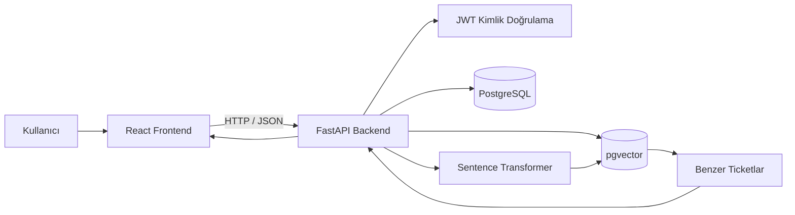

<div align="center">

# IntelliDesk

### Yapay Zekâ Destekli Service Desk ve Ticket Yönetim Sistemi

Geçmiş destek kayıtlarını ve çözümlerini kullanarak yeni ticketlar için
çözüm önerileri üreten full-stack Service Desk uygulaması.

[](https://www.python.org/)
[](https://fastapi.tiangolo.com/)
[](https://react.dev/)
[](https://www.postgresql.org/)
[](https://github.com/pgvector/pgvector)

</div>

---

## Proje Hakkında

IntelliDesk, şirketlerde tekrar eden bilgi işlem sorunlarının daha hızlı
çözülmesini amaçlayan yapay zekâ destekli bir yardım masası sistemidir.

Yeni bir ticket oluşturulduğunda sistem:

1. Ticket konusu ve açıklamasından embedding oluşturur.
2. Geçmiş çözülmüş kayıtlarla benzerlik karşılaştırması yapar.
3. En uygun geçmiş ticketları sıralar.
4. Teknik personele çözüm önerisi ve güven puanı sunar.
5. Önerinin kabul veya reddedilmesini kaydeder.

Sistem yalnızca AI önerisi üretmez. Kullanıcı, teknisyen ve yönetici
rolleriyle tam bir ticket yönetim süreci sağlar.

---

## Temel Özellikler

### Ticket Yönetimi

- Yeni ticket oluşturma
- Ticket listeleme ve detay görüntüleme
- Durum ve öncelik güncelleme
- Departman, kategori ve alt kategori seçme
- Teknik personel atama
- Çözüm bilgisini kaydetme
- Arama, filtreleme, sıralama ve sayfalama
- Ticket yorumları ve işlem geçmişi
- Kullanıcıya veya teknisyene özel ticket görünümü

### Yapay Zekâ ve RAG

- Türkçe destekli embedding modeli
- pgvector ile anlamsal benzerlik araması
- Semantik ve kelime tabanlı hibrit sıralama
- En benzer geçmiş ticketları listeleme
- Çözüm önerisi oluşturma
- Güven puanı gösterme
- Düşük güven durumunda manuel inceleme uyarısı
- AI önerisini kabul veya reddetme
- Geri bildirim açıklaması kaydetme

### Kimlik Doğrulama ve Yetkilendirme

- JWT tabanlı oturum yönetimi
- Argon2 parola hashleme
- Aktif ve pasif hesap kontrolü
- Rol tabanlı endpoint yetkilendirmesi
- Kullanıcı, teknisyen ve yönetici rolleri
- Yönetici kullanıcı yönetimi

### SLA ve Bildirimler

- Önceliğe göre ilk cevap ve çözüm hedefleri
- SLA sürelerinin otomatik hesaplanması
- SLA Yönetimi ekranı
- Yaklaşan ve ihlal edilen SLA uyarıları
- Ticket atama bildirimleri
- Okundu ve okunmadı bildirim yönetimi

### Sistem Takibi

- Ticket oluşturma ve güncelleme kayıtları
- Ticket yorum geçmişi
- Başarılı ve başarısız giriş kayıtları
- Kullanıcı rolü ve hesap durumu değişiklikleri
- Yöneticiye özel Sistem Logları ekranı
- İşlem yapan kullanıcı, IP adresi ve endpoint bilgileri

### Dashboard

- Toplam ticket sayısı
- Açık, çözülmüş ve kapatılmış ticket sayıları
- AI önerisi oluşturulan ticket sayısı
- Ortalama AI güven puanı
- Durum, öncelik, kategori ve departman dağılımları
- Son yedi günlük ticket hareketleri
- Son oluşturulan ticketlar

### Arayüz

- React tabanlı responsive tasarım
- Açık ve koyu tema
- Mobil uyumlu sidebar
- Türkçe kullanıcı arayüzü
- Form hata ve başarı mesajları

---

## Sistem Mimarisi



### Teknoloji Yığını

| Katman           | Teknolojiler                |
| ---------------- | --------------------------- |
| Frontend         | React, Vite, React Router   |
| Backend          | Python, FastAPI, SQLAlchemy |
| Veritabanı       | PostgreSQL                  |
| Vektör Arama     | pgvector                    |
| AI Modeli        | Sentence Transformers       |
| Kimlik Doğrulama | JWT, Argon2                 |
| Migration        | Alembic                     |
| Test             | pytest                      |

---

## RAG Yapısı

Kullanılan embedding modeli:

```text
sentence-transformers/paraphrase-multilingual-MiniLM-L12-v2
```

Sıralama sistemi aşağıdaki bilgileri birlikte değerlendirir:

- Embedding benzerliği
- Konu ve açıklamadaki ortak kelimeler
- Kelime kökü benzerlikleri
- Ticket konusunun eşleşme oranı
- Dahili numara veya hata kodu gibi tanımlayıcılar

Geçmiş Service Desk verileri normal kullanıcı ticketlarından ayrı tutulur:

- `rag_ticket_data`: Geçmiş ticket metinleri ve çözümleri
- `ticket_embeddings`: Geçmiş kayıtların embedding vektörleri
- `tickets`: Uygulama üzerinden oluşturulan normal ticketlar

Projede kullanılan 4993 geçmiş kayıt yalnızca RAG veri tablolarında tutulur.

---

## Kullanıcı Rolleri

| Rol          | Yetkiler                                           |
| ------------ | -------------------------------------------------- |
| `user`       | Ticket oluşturma ve kendi ticketlarını görüntüleme |
| `technician` | Atanan ticketları yönetme ve AI önerisi kullanma   |
| `admin`      | Tüm ticketları, kullanıcıları ve logları yönetme   |

Yönetici güvenliği için:

- Admin kendi hesabını pasif yapamaz.
- Admin kendi rolünü düşüremez.
- Sistemdeki son aktif admin devre dışı bırakılamaz.

---

## Proje Yapısı

```text
IntelliDesk/
│
├── backend/
│   ├── alembic/
│   ├── app/
│   │   ├── audit/
│   │   ├── notifications/
│   │   ├── routers/
│   │   ├── sla/
│   │   ├── timeline/
│   │   ├── database.py
│   │   ├── main.py
│   │   ├── models.py
│   │   ├── schemas.py
│   │   ├── security.py
│   │   └── services.py
│   ├── tests/
│   │   ├── conftest.py
│   │   ├── test_rag_ranking.py
│   │   └── README.md
│   ├── .env.example
│   ├── alembic.ini
│   └── requirements-dev.txt
│
├── frontend/
│   ├── src/
│   │   ├── api/
│   │   ├── auth/
│   │   ├── components/
│   │   ├── pages/
│   │   └── styles/
│   ├── package.json
│   └── vite.config.js
│
├── .gitignore
└── README.md
```

---

## Kurulum

### 1. Repoyu Klonlama

```powershell
git clone https://github.com/hypervsec/IntelliDesk.git

cd IntelliDesk
```

### 2. Python Sanal Ortamı

```powershell
python -m venv .venv

.\.venv\Scripts\Activate.ps1
```

### 3. Backend Bağımlılıkları

Geliştirme ve test bağımlılıklarını yükleyin:

```powershell
python -m pip install -r backend\requirements-dev.txt
```

### 4. Frontend Bağımlılıkları

```powershell
cd frontend

npm install
```

---

## PostgreSQL ve pgvector

PostgreSQL üzerinde proje veritabanını oluşturun ve pgvector
eklentisini etkinleştirin:

```sql
CREATE EXTENSION IF NOT EXISTS vector;
```

Projede geliştirme veritabanı varsayılan olarak `5433` portunu kullanır.

---

## Ortam Değişkenleri

Örnek dosyayı kopyalayın:

```powershell
Copy-Item backend\.env.example backend\.env
```

`backend/.env` dosyasındaki değerleri kendi sisteminize göre düzenleyin.

Örnek değişkenler:

```env
DB_HOST=127.0.0.1
DB_PORT=5433
DB_NAME=Intellidesk
DB_USER=postgres
DB_PASSWORD=your_database_password

JWT_SECRET_KEY=your_secure_random_secret
ACCESS_TOKEN_EXPIRE_MINUTES=60
```

Gerçek parola ve gizli anahtarlar GitHub'a gönderilmemelidir.

---

## Veritabanı Migration İşlemleri

```powershell
cd backend

alembic upgrade head
```

Yeni migration oluşturmak için:

```powershell
alembic revision --autogenerate -m "migration description"
```

---

## Uygulamayı Çalıştırma

### Backend

Sanal ortam açıkken:

```powershell
cd C:\Users\enesm\Desktop\IntelliDesk\backend

python -m uvicorn app.main:app --reload
```

Backend adresleri:

```text
http://127.0.0.1:8000
http://127.0.0.1:8000/docs
```

### Frontend

İkinci bir terminalde:

```powershell
cd C:\Users\enesm\Desktop\IntelliDesk\frontend

npm run dev
```

Frontend adresi:

```text
http://localhost:5173
```

---

## Önemli API Endpointleri

### Kimlik Doğrulama

```text
POST /auth/register
POST /auth/login
GET  /auth/me
```

### Ticket İşlemleri

```text
GET    /tickets
POST   /tickets
GET    /tickets/{ticket_id}
PUT    /tickets/{ticket_id}
DELETE /tickets/{ticket_id}
```

### Ticket Yorumları ve İşlem Geçmişi

```text
GET  /tickets/{ticket_id}/timeline
POST /tickets/{ticket_id}/comments
```

### AI İşlemleri

```text
POST /tickets/{ticket_id}/recommendation
POST /tickets/{ticket_id}/feedback
```

### Bildirimler

```text
GET   /notifications
PATCH /notifications/read-all
PATCH /notifications/{notification_id}/read
```

### Sistem Logları

```text
GET /audit-logs
GET /audit-logs/action-types
```

### Dashboard ve Kullanıcılar

```text
GET /dashboard/summary
GET /users
PUT /users/{user_id}
```

Tüm endpointler ve istek modelleri Swagger arayüzünden incelenebilir:

```text
http://127.0.0.1:8000/docs
```

---

## Test ve Derleme

### Backend Syntax Kontrolü

```powershell
cd backend

python -m compileall app tests
```

### RAG Regresyon Testleri

Testler gerçek PostgreSQL veritabanını ve geçmiş RAG kayıtlarını kullanır.

```powershell
cd backend

python -m pytest -v
```

Yalnızca RAG sıralama testlerini çalıştırmak için:

```powershell
python -m pytest tests\test_rag_ranking.py -v
```

Mevcut testler:

- DECT sorgusunda `21373` numaralı kaydın ilk sırada bulunması
- Yazıcı görüntüleme birimi sorgusunda `17832` numaralı kaydın ilk sırada bulunması

Ayrıntılı test açıklaması:

```text
backend/tests/README.md
```

### Frontend Kontrolleri

```powershell
cd frontend

npm run lint
npm run build
```

Başarılı production build çıktısı:

```text
frontend/dist
```

---

## Güvenlik

- Parolalar düz metin olarak saklanmaz.
- Parolalar Argon2 ile hashlenir.
- JWT issuer, audience ve süre bilgileri doğrulanır.
- Backend endpointlerinde rol kontrolü yapılır.
- Pasif kullanıcıların giriş yapması engellenir.
- Teknik personel atamaları backend tarafından doğrulanır.
- Yönetim işlemleri sistem loglarına kaydedilir.
- `.env` ve yerel veritabanı yedekleri Git tarafından dışlanır.

---

## Proje Durumu

Tamamlanan temel bölümler:

- Kimlik doğrulama ve rol tabanlı yetkilendirme
- Ticket CRUD, arama, filtreleme ve sayfalama
- Teknik personel atama
- Dashboard ve kullanıcı yönetimi
- AI çözüm önerisi ve hibrit RAG sıralaması
- AI geri bildirim sistemi
- Ticket yorumları ve işlem geçmişi
- SLA yönetimi ve otomatik SLA uyarıları
- Kalıcı bildirim sistemi
- Sistem ve kullanıcı işlem logları
- Açık ve koyu tema
- Alembic migration yapısı
- RAG regresyon testleri

---

## Gelecek Geliştirmeler

- Daha fazla RAG regresyon senaryosu
- Otomatik testlerin GitHub Actions üzerinde çalıştırılması
- Dosya ve ekran görüntüsü ekleme
- Gelişmiş raporlama
- Production deployment
- RAG performans ve doğruluk metrikleri

## Geliştirici

**Enes Menüş**

- [LinkedIn](https://www.linkedin.com/in/enesmenus)

---

## Lisans

Bu proje eğitim, staj ve portföy çalışması amacıyla geliştirilmiştir.
