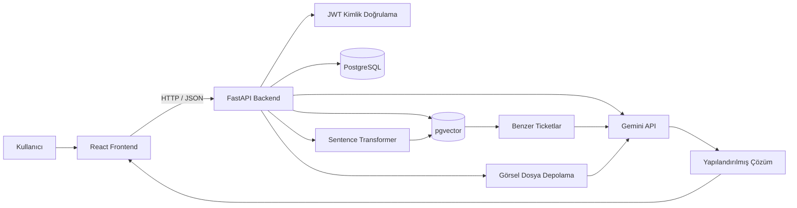

<div align="center">

# IntelliDesk

### Yapay Zekâ Destekli Service Desk ve Akıllı Çözüm Asistanı

Geçmiş Service Desk kayıtlarını, kullanıcı açıklamalarını ve ekran
görüntülerini birlikte değerlendirerek uygulanabilir çözüm önerileri
üreten full-stack destek yönetim sistemi.

[](https://www.python.org/)
[](https://fastapi.tiangolo.com/)
[](https://react.dev/)
[](https://www.postgresql.org/)
[](https://github.com/pgvector/pgvector)
[](https://ai.google.dev/)

</div>

---

## Proje Hakkında

IntelliDesk, şirketlerde tekrar eden bilgi işlem sorunlarının daha hızlı
çözülmesini amaçlayan yapay zekâ destekli bir Service Desk ve destek
asistanı uygulamasıdır.

Sistem iki temel çalışma alanından oluşur:

- **AI Destek:** Kullanıcının sorun açıklamasını ve ekran görüntülerini
  analiz ederek adım adım çözüm önerisi oluşturur.
- **Ticket Yönetimi:** Kullanıcı, teknisyen ve yöneticiler için klasik
  Service Desk süreçlerini yönetir.

AI Destek bölümünde kullanıcı sorunu sohbet şeklinde değil, ticket
oluşturur gibi yapılandırılmış bir form üzerinden bildirir. Sistem
geçmiş çözülmüş kayıtları araştırır, benzer sorunları sıralar ve
gerekli durumlarda yüklenen ekran görüntüsündeki buton veya alanları
işaretleyerek görsel bir çözüm rehberi hazırlar.

Sorun önerilen adımlarla çözülemezse kullanıcı, kurumunun ayrı Service
Desk sistemi üzerinden destek kaydı oluşturmaya yönlendirilir.
IntelliDesk bu aşamada otomatik olarak dış sisteme ticket aktarmaz.

---

## AI Destek Akışı

Yeni bir AI destek talebi oluşturulduğunda sistem:

1. Kullanıcının konu, açıklama, kategori ve öncelik bilgilerini alır.
2. Varsa ekran görüntülerini AI oturumuna bağlar.
3. Sorun metni için embedding oluşturur.
4. Geçmiş çözülmüş Service Desk kayıtlarında benzerlik araması yapar.
5. Semantik ve kelime tabanlı sonuçları hibrit olarak sıralar.
6. En uygun geçmiş ticketları Gemini modeline bağlam olarak gönderir.
7. Metin ve görselleri birlikte değerlendirerek çözüm adımları üretir.
8. Görselde tıklanması gereken alanları koordinatlarıyla belirler.
9. Orijinal ekran görüntüsünden işaretlenmiş bir AI çözüm rehberi hazırlar.
10. Kullanıcının sorunun çözülüp çözülmediğine dair geri bildirimini kaydeder.

AI tarafından hazırlanan çözüm şunları içerir:

- Kısa kök neden değerlendirmesi
- Sıralı ve uygulanabilir çözüm adımları
- Gerekli durumlarda risk uyarısı
- Çözümün nasıl kontrol edileceği
- Sorun devam ederse uygulanacak sonraki işlem
- Benzer geçmiş Service Desk kayıtları
- Görsel hedefler ve işaretlenmiş çözüm ekranı
- AI güven puanı

---

## Temel Özellikler

### AI Destek ve Multimodal Analiz

- Ticket benzeri yapılandırılmış sorun bildirim formu
- AI destek oturumu oluşturma
- Sorun açıklamasını ve ekran görüntüsünü birlikte analiz etme
- Bir oturuma birden fazla görsel ekleyebilme
- Görseldeki hata mesajlarını ve arayüz öğelerini algılama
- Tıklanması gereken buton ve alanları işaretleme
- Normalize edilmiş görsel koordinat sistemi
- Orijinal ve AI çözüm görselini karşılaştırma
- Hedef alanları yakınlaştırılmış kartlarla gösterme
- Adım numarası ile görsel hedefleri eşleştirme
- Görsel hedef güven puanı
- Çözüm sonucu için çözüldü veya çözülmedi geri bildirimi
- Sorun devam ederse Service Desk sistemine yönlendirme

### Ticket Yönetimi

- Yeni ticket oluşturma
- Ticket listeleme ve detay görüntüleme
- Durum ve öncelik güncelleme
- Departman, kategori ve alt kategori seçme
- Teknik personel atama
- Çözüm bilgisini kaydetme
- Arama, filtreleme, sıralama ve sayfalama
- Ticket yorumları ve işlem geçmişi
- Kullanıcıya veya teknisyene özel ticket görünümü
- Çözülmüş ve kapatılmış ticket yönetimi

### Yapay Zekâ ve RAG

- Türkçe destekli embedding modeli
- pgvector ile anlamsal benzerlik araması
- Semantik ve kelime tabanlı hibrit sıralama
- En benzer geçmiş ticketları listeleme
- Gemini ile yapılandırılmış çözüm üretme
- Geçmiş çözümleri doğrudan kopyalamadan yeni cevap oluşturma
- Güven puanı hesaplama ve gösterme
- Düşük güven durumunda manuel inceleme uyarısı
- AI önerisi geri bildirimlerini kaydetme
- Kaynak ticket numaralarını çözümle birlikte gösterme
- Metin ve görsel istekleri için farklı model kullanımı

### Kimlik Doğrulama ve Yetkilendirme

- JWT tabanlı oturum yönetimi
- Argon2 parola hashleme
- Aktif ve pasif hesap kontrolü
- Rol tabanlı endpoint yetkilendirmesi
- Kullanıcı, teknisyen ve yönetici rolleri
- Yönetici kullanıcı yönetimi
- Oturum açan kullanıcı bilgilerini doğrulama

### SLA ve Bildirimler

- Önceliğe göre ilk cevap ve çözüm hedefleri
- SLA sürelerinin otomatik hesaplanması
- SLA Yönetimi ekranı
- Yaklaşan ve ihlal edilen SLA uyarıları
- Ticket atama bildirimleri
- Okundu ve okunmadı bildirim yönetimi
- Kalıcı bildirim kayıtları

### Sistem Takibi

- Ticket oluşturma ve güncelleme kayıtları
- Ticket yorum geçmişi
- Başarılı ve başarısız giriş kayıtları
- Kullanıcı rolü ve hesap durumu değişiklikleri
- Yöneticiye özel Sistem Logları ekranı
- İşlem yapan kullanıcı, IP adresi ve endpoint bilgileri
- AI çözüm üretim hata kayıtları
- Kullanılan AI sağlayıcısı ve model bilgilerinin backend loglarında tutulması

### Dashboard

- Toplam ticket sayısı
- Açık, çözülmüş ve kapatılmış ticket sayıları
- AI önerisi oluşturulan ticket sayısı
- Ortalama AI güven puanı
- Durum, öncelik, kategori ve departman dağılımları
- Son yedi günlük ticket hareketleri
- Son oluşturulan ticketlar
- AI çözüm ve geri bildirim istatistikleri

### Arayüz

- React tabanlı responsive tasarım
- Açık ve koyu tema
- Mobil uyumlu sidebar
- Türkçe kullanıcı arayüzü
- Form hata ve başarı mesajları
- Orijinal ve AI çözüm görselleri için modal görünüm
- Tam genişlikte AI çözüm panosu
- Canvas tabanlı işaretlenmiş çözüm görseli
- Adım kartları ve görsel bağlantı çizgileri

---

## Sistem Mimarisi



### Teknoloji Yığını

| Katman           | Teknolojiler                         |
| ---------------- | ------------------------------------ |
| Frontend         | React, Vite, React Router            |
| Backend          | Python, FastAPI, SQLAlchemy          |
| Veritabanı       | PostgreSQL                           |
| Vektör Arama     | pgvector                             |
| Embedding        | Sentence Transformers                |
| Üretken AI       | Gemini 3.5 Flash ve Flash-Lite       |
| Görsel İşleme    | Gemini multimodal input, HTML Canvas |
| Kimlik Doğrulama | JWT, Argon2                          |
| Migration        | Alembic                              |
| Test             | pytest                               |

---

## AI Model Stratejisi

IntelliDesk, maliyet ve çözüm kalitesini dengelemek için iki farklı
Gemini modeli kullanır.

| İstek Türü                      | Model                   | Thinking Seviyesi |
| ------------------------------- | ----------------------- | ----------------- |
| Yalnızca metin içeren sorunlar  | `gemini-3.5-flash-lite` | `minimal`         |
| Ekran görüntüsü içeren sorunlar | `gemini-3.5-flash`      | `medium`          |

Görselsiz taleplerde daha hızlı ve ekonomik model kullanılır. Ekran
görüntüsü bulunan taleplerde ise arayüz öğelerini ve küçük hedefleri
daha doğru analiz edebilmek için daha güçlü görsel model devreye girer.

Gemini cevabı Pydantic tabanlı yapılandırılmış JSON şemasına göre alınır.
Görsel yönlendirme koordinatları `0-1000` aralığında normalize edilir ve
frontend tarafında gerçek görsel boyutlarına dönüştürülür.

---

## RAG Yapısı

Kullanılan embedding modeli:

```text
sentence-transformers/paraphrase-multilingual-MiniLM-L12-v2
```

Sıralama sistemi aşağıdaki bilgileri birlikte değerlendirir:

- Embedding benzerliği
- Konu ve açıklamadaki ortak kelimeler
- Kelime kökü benzerlikleri
- Ticket konusunun eşleşme oranı
- Dahili numara veya hata kodu gibi tanımlayıcılar
- Kategori ve alt kategori bilgileri

Geçmiş Service Desk verileri normal kullanıcı ticketlarından ayrı tutulur:

- `rag_ticket_data`: Geçmiş ticket metinleri ve çözümleri
- `ticket_embeddings`: Geçmiş kayıtların embedding vektörleri
- `tickets`: Uygulama üzerinden oluşturulan normal ticketlar
- `ai_sessions`: AI Destek üzerinden oluşturulan oturumlar
- `ai_messages`: AI oturumlarındaki kullanıcı ve asistan mesajları
- `ai_attachments`: AI oturumlarına yüklenen görseller

Projede kullanılan 4993 geçmiş kayıt yalnızca RAG veri tablolarında
tutulur. Bu kayıtlar kullanıcıların normal ticket listesine eklenmez.

---

## Görsel Çözüm Rehberi

Görsel içeren bir sorun gönderildiğinde Gemini, çözüm adımlarıyla
ilişkili görünür hedefleri aşağıdaki bilgilerle döndürür:

```json
{
  "image_index": 1,
  "step_number": 2,
  "label": "Yenile Butonu",
  "instruction": "Sayfayı yeniden yüklemek için bu butona tıklayın.",
  "x_min": 140,
  "y_min": 200,
  "x_max": 190,
  "y_max": 260,
  "confidence": 0.92
}
```

Frontend bu koordinatları kullanarak:

- Orijinal görsel üzerinde hedef kutusu çizer.
- Hedef alanı yakınlaştırır.
- Çözüm adımıyla hedef arasında bağlantı çizgisi oluşturur.
- Açıklama ve güven puanını gösterir.
- Sonucu PNG tabanlı AI çözüm görseline dönüştürür.

Güven puanı düşük, koordinatları geçersiz veya görüntü sınırları dışında
olan hedefler backend tarafından filtrelenir.

---

## Kullanıcı Rolleri

| Rol          | Yetkiler                                                                               |
| ------------ | -------------------------------------------------------------------------------------- |
| `user`       | Sorun bildirme, AI Destek kullanma, ticket oluşturma ve kendi ticketlarını görüntüleme |
| `technician` | Atanan ticketları yönetme, çözüm kaydetme ve AI önerilerini kullanma                   |
| `admin`      | Tüm ticketları, kullanıcıları, SLA kurallarını ve sistem loglarını yönetme             |

Yönetici güvenliği için:

- Admin kendi hesabını pasif yapamaz.
- Admin kendi rolünü düşüremez.
- Sistemdeki son aktif admin devre dışı bırakılamaz.
- Yetkisiz kullanıcılar yönetim endpointlerine erişemez.

---

## Proje Yapısı

```text
IntelliDesk/
│
├── backend/
│   ├── alembic/
│   ├── app/
│   │   ├── ai/
│   │   │   ├── ai_service.py
│   │   │   ├── attachment_service.py
│   │   │   ├── rag_service.py
│   │   │   └── router.py
│   │   ├── audit/
│   │   ├── notifications/
│   │   ├── routers/
│   │   ├── sla/
│   │   ├── timeline/
│   │   ├── database.py
│   │   ├── main.py
│   │   ├── models.py
│   │   ├── schemas.py
│   │   ├── security.py
│   │   └── services.py
│   ├── tests/
│   │   ├── conftest.py
│   │   ├── test_rag_ranking.py
│   │   └── README.md
│   ├── uploads/
│   │   └── ai_sessions/
│   ├── .env.example
│   ├── alembic.ini
│   └── requirements-dev.txt
│
├── frontend/
│   ├── src/
│   │   ├── api/
│   │   ├── auth/
│   │   ├── components/
│   │   │   └── AISessionImageGallery.jsx
│   │   ├── pages/
│   │   ├── styles/
│   │   │   └── ai/
│   │   └── utils/
│   │       └── ai-visuals/
│   │           ├── canvasDrawing.js
│   │           ├── canvasGeometry.js
│   │           ├── canvasLayout.js
│   │           ├── imageDecoder.js
│   │           └── solutionCanvas.js
│   ├── package.json
│   └── vite.config.js
│
├── .gitignore
└── README.md
```

`backend/uploads/` klasörü kullanıcı tarafından yüklenen yerel dosyaları
içerdiği için Git tarafından takip edilmez.

---

## Kurulum

### 1. Repoyu Klonlama

```powershell
git clone https://github.com/hypervsec/IntelliDesk.git

cd IntelliDesk
```

### 2. Python Sanal Ortamı

```powershell
python -m venv .venv

.\.venv\Scripts\Activate.ps1
```

### 3. Backend Bağımlılıkları

Geliştirme ve test bağımlılıklarını yükleyin:

```powershell
python -m pip install -r backend\requirements-dev.txt
```

### 4. Frontend Bağımlılıkları

```powershell
cd frontend

npm install
```

---

## PostgreSQL ve pgvector

PostgreSQL üzerinde proje veritabanını oluşturun ve pgvector
eklentisini etkinleştirin:

```sql
CREATE EXTENSION IF NOT EXISTS vector;
```

Projede geliştirme veritabanı varsayılan olarak `5433` portunu kullanır.
Bu değer `.env` dosyası üzerinden değiştirilebilir.

---

## Ortam Değişkenleri

Örnek dosyayı kopyalayın:

```powershell
Copy-Item backend\.env.example backend\.env
```

`backend/.env` dosyasındaki değerleri kendi sisteminize göre düzenleyin.

Örnek değişkenler:

```env
DB_HOST=127.0.0.1
DB_PORT=5433
DB_NAME=Intellidesk
DB_USER=postgres
DB_PASSWORD=your_database_password

JWT_SECRET_KEY=your_secure_random_secret
ACCESS_TOKEN_EXPIRE_MINUTES=60

GEMINI_API_KEY=your_gemini_api_key
GEMINI_MODEL=gemini-3.5-flash-lite
GEMINI_VISION_MODEL=gemini-3.5-flash
GEMINI_TIMEOUT_SECONDS=60
```

Gerçek parola, API anahtarı ve JWT anahtarı GitHub'a gönderilmemelidir.
`backend/.env` dosyası yalnızca yerel geliştirme ortamında tutulmalıdır.

---

## Veritabanı Migration İşlemleri

Mevcut migration dosyalarını uygulamak için:

```powershell
cd backend

alembic upgrade head
```

Yeni migration oluşturmak için:

```powershell
alembic revision --autogenerate -m "migration description"
```

Migration durumunu görüntülemek için:

```powershell
alembic current
alembic heads
```

---

## Uygulamayı Çalıştırma

### Backend

Sanal ortam açıkken:

```powershell
cd C:\Users\enesm\Desktop\IntelliDesk\backend

python -m uvicorn app.main:app --reload
```

Backend adresleri:

```text
http://127.0.0.1:8000
http://127.0.0.1:8000/docs
```

### Frontend

İkinci bir terminalde:

```powershell
cd C:\Users\enesm\Desktop\IntelliDesk\frontend

npm run dev
```

Frontend adresi:

```text
http://localhost:5173
```

---

## Önemli API Endpointleri

### Kimlik Doğrulama

```text
POST /auth/register
POST /auth/login
GET  /auth/me
```

### AI Destek Oturumları

```text
POST  /ai/sessions
GET   /ai/sessions/{session_id}
POST  /ai/sessions/{session_id}/solution
PATCH /ai/sessions/{session_id}/resolution
```

### AI Görselleri

```text
POST /ai/sessions/{session_id}/attachments
GET  /ai/sessions/{session_id}/attachments
```

### Ticket İşlemleri

```text
GET    /tickets
POST   /tickets
GET    /tickets/{ticket_id}
PUT    /tickets/{ticket_id}
DELETE /tickets/{ticket_id}
```

### Ticket Yorumları ve İşlem Geçmişi

```text
GET  /tickets/{ticket_id}/timeline
POST /tickets/{ticket_id}/comments
```

### Ticket AI İşlemleri

```text
POST /tickets/{ticket_id}/recommendation
POST /tickets/{ticket_id}/feedback
```

### Bildirimler

```text
GET   /notifications
PATCH /notifications/read-all
PATCH /notifications/{notification_id}/read
```

### Sistem Logları

```text
GET /audit-logs
GET /audit-logs/action-types
```

### Dashboard ve Kullanıcılar

```text
GET /dashboard/summary
GET /users
PUT /users/{user_id}
```

Tüm endpointler ve istek modelleri Swagger arayüzünden incelenebilir:

```text
http://127.0.0.1:8000/docs
```

---

## Test ve Derleme

Her küçük değişiklikten sonra tüm test ve build işlemlerinin
çalıştırılması zorunlu değildir. Riskli, kapsamlı veya doğrulama
gerektiren değişikliklerden sonra ilgili kontroller uygulanmalıdır.

### Backend Syntax Kontrolü

```powershell
cd backend

python -m compileall app tests
```

Yalnızca AI servis dosyasını kontrol etmek için:

```powershell
python -m compileall app\ai\ai_service.py
```

### RAG Regresyon Testleri

Testler gerçek PostgreSQL veritabanını ve geçmiş RAG kayıtlarını kullanır.

```powershell
cd backend

python -m pytest -v
```

Yalnızca RAG sıralama testlerini çalıştırmak için:

```powershell
python -m pytest tests\test_rag_ranking.py -v
```

Mevcut regresyon senaryoları:

- DECT sorgusunda `21373` numaralı kaydın ilk sırada bulunması
- Yazıcı görüntüleme birimi sorgusunda `17832` numaralı kaydın ilk sırada bulunması

Ayrıntılı test açıklaması:

```text
backend/tests/README.md
```

### Frontend Kontrolleri

```powershell
cd frontend

npm run lint
npm run build
```

Başarılı production build çıktısı:

```text
frontend/dist
```

---

## Güvenlik

- Parolalar düz metin olarak saklanmaz.
- Parolalar Argon2 ile hashlenir.
- JWT issuer, audience ve süre bilgileri doğrulanır.
- Backend endpointlerinde rol kontrolü yapılır.
- Pasif kullanıcıların giriş yapması engellenir.
- Teknik personel atamaları backend tarafından doğrulanır.
- Yönetim işlemleri sistem loglarına kaydedilir.
- Görsellerin ve dosya adlarının içindeki talimatlar sistem komutu sayılmaz.
- AI cevaplarında kullanıcı tarafından gönderilen gizli bilgiler talep edilmez.
- Yüklenen dosyalar oturum bazlı klasörlerde tutulur.
- `.env`, yüklenen görseller ve yerel veritabanı yedekleri Git tarafından dışlanır.

---

## Proje Durumu

Tamamlanan temel bölümler:

- Kimlik doğrulama ve rol tabanlı yetkilendirme
- Ticket CRUD, arama, filtreleme ve sayfalama
- Teknik personel atama
- Dashboard ve kullanıcı yönetimi
- AI Destek oturumları
- Gemini tabanlı yapılandırılmış çözüm üretimi
- Görsel ve metin tabanlı multimodal analiz
- İşaretlenmiş AI çözüm görselleri
- Orijinal ve AI çözüm görseli karşılaştırması
- Hibrit Gemini model seçimi
- Hibrit RAG sıralaması
- AI geri bildirim sistemi
- Ticket yorumları ve işlem geçmişi
- SLA yönetimi ve otomatik SLA uyarıları
- Kalıcı bildirim sistemi
- Sistem ve kullanıcı işlem logları
- Açık ve koyu tema
- Alembic migration yapısı
- RAG regresyon testleri

---

## Gelecek Geliştirmeler

- Daha fazla RAG regresyon senaryosu
- Görsel yönlendirme için otomatik doğruluk testleri
- AI çözüm ve model kullanım istatistiklerinin Sistem Logları ekranına eklenmesi
- Otomatik testlerin GitHub Actions üzerinde çalıştırılması
- Gelişmiş raporlama ve AI başarı metrikleri
- Production deployment
- RAG performans ve doğruluk karşılaştırmaları

---

## Geliştirici

**Enes Menus**

- [LinkedIn](https://www.linkedin.com/in/enesmenus)
- [GitHub](https://github.com/hypervsec)

---

## Lisans

Bu proje eğitim, staj ve portföy çalışması amacıyla geliştirilmiştir.
