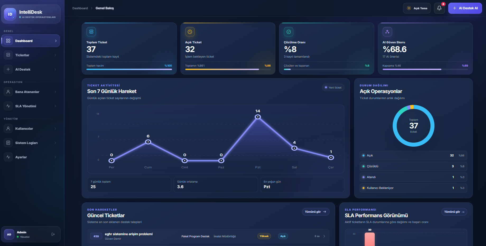
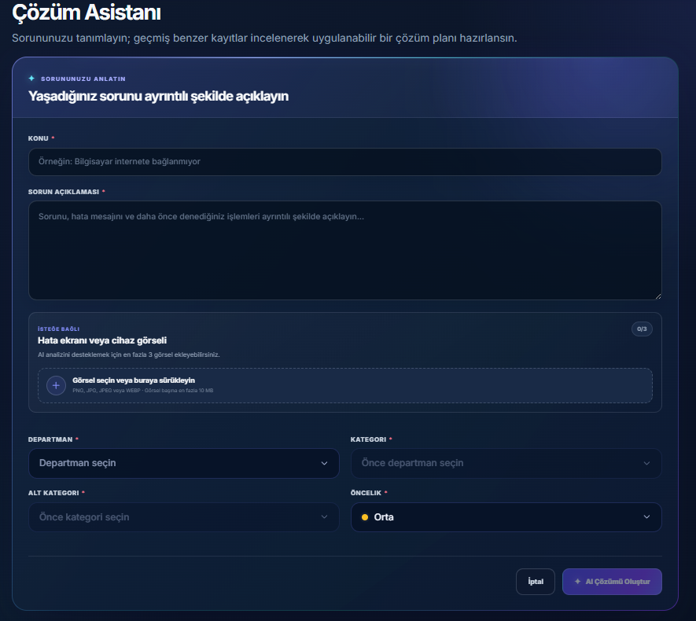
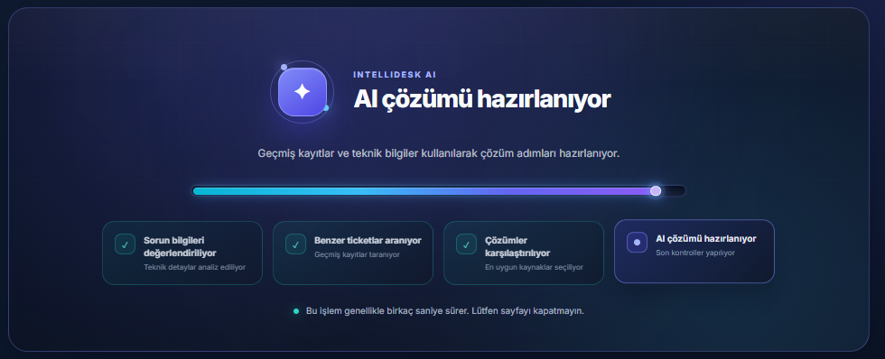
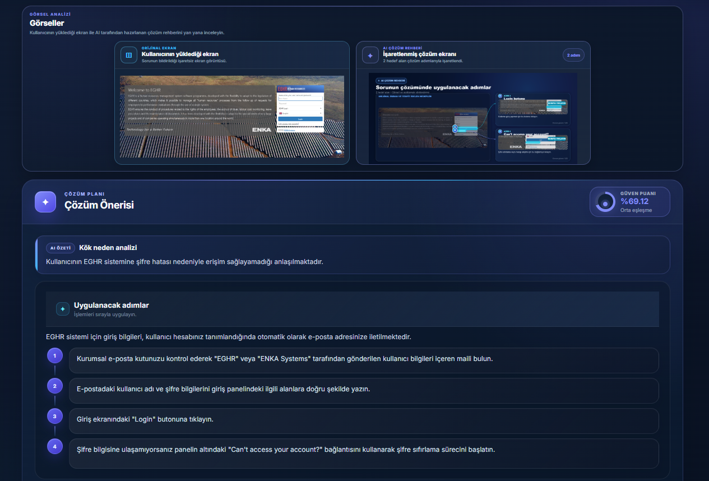
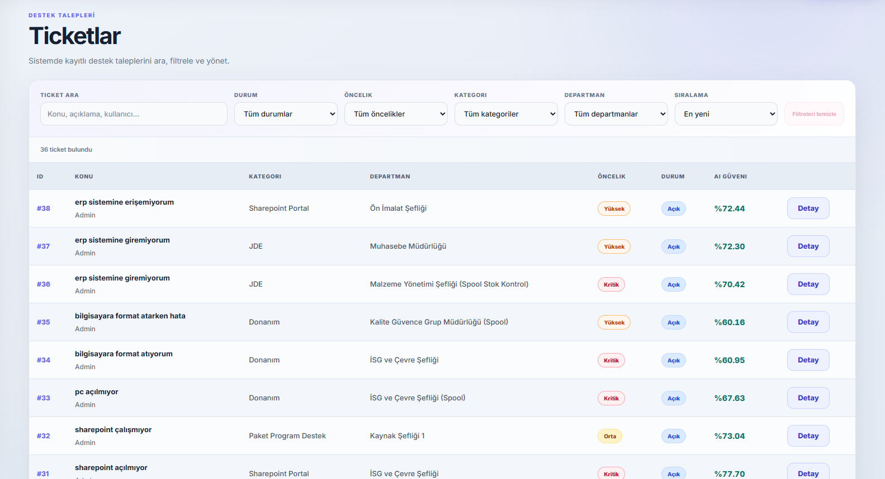
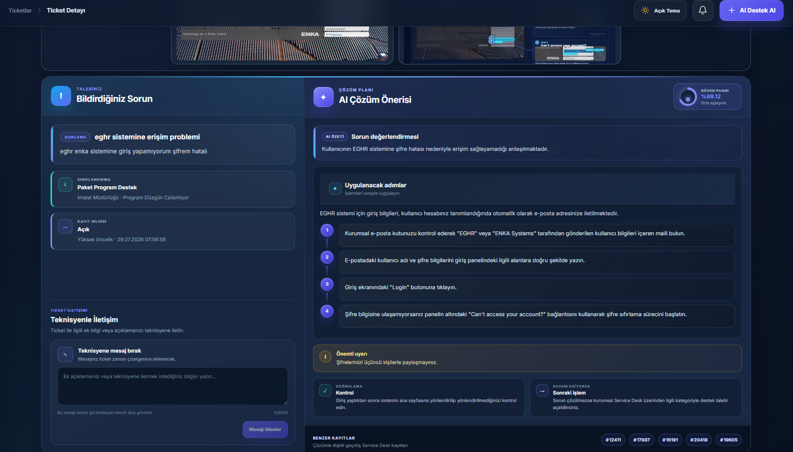
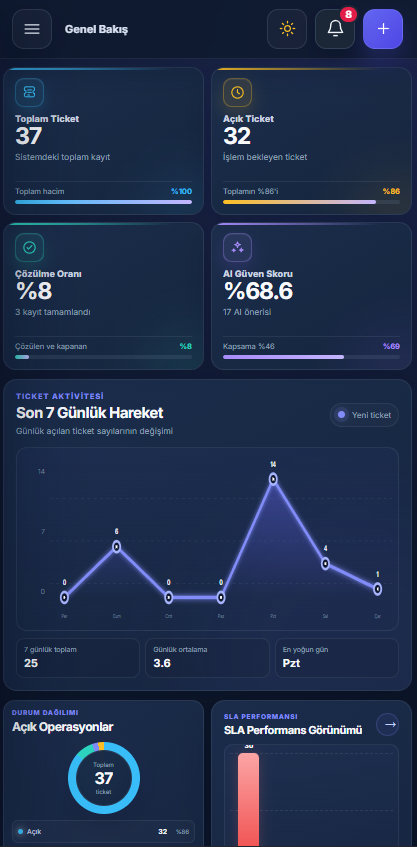
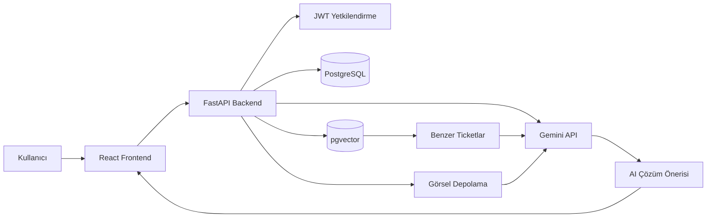

<div align="center">

# IntelliDesk

### Yapay Zekâ Destekli IT Asistanı ve Service Desk Platformu

Kullanıcı sorunlarını, geçmiş Service Desk kayıtlarını ve ekran
görüntülerini birlikte analiz ederek uygulanabilir çözüm önerileri
oluşturan full-stack destek yönetim sistemi.

[](https://www.python.org/)
[](https://fastapi.tiangolo.com/)
[](https://react.dev/)
[](https://www.postgresql.org/)
[](https://github.com/pgvector/pgvector)
[](https://ai.google.dev/)
[](https://www.docker.com/)

[Canlı Uygulama](https://intellideskai.netlify.app)

</div>

---

## Proje Hakkında

IntelliDesk, tekrar eden IT destek taleplerinde kullanıcıların ve teknik
ekibin yaşadığı zaman kaybını azaltmak amacıyla geliştirilmiştir.

Sistem iki temel bölümden oluşur:

- **AI Destek:** Kullanıcının sorun açıklamasını ve ekran görüntülerini
  analiz ederek adım adım çözüm önerisi hazırlar.
- **Ticket Yönetimi:** Ticket oluşturma, atama, takip, yorum, SLA ve
  çözüm süreçlerini merkezi olarak yönetir.

AI Destek ekranında kullanıcı sorunu sohbet şeklinde değil, ticket
oluşturur gibi yapılandırılmış bir form üzerinden bildirir. Sistem,
4.993 geçmiş çözülmüş Service Desk kaydı arasından benzer sorunları
bulur ve Gemini ile yeni bir çözüm planı oluşturur.

Sorun çözülemezse kullanıcı kurumun Service Desk sisteminde destek
kaydı açmaya yönlendirilir. Dış sisteme otomatik ticket aktarımı
yapılmaz.

---

## Ekran Görüntüleri

Görselleri `docs/screenshots/` klasörüne ekledikten sonra aşağıdaki
yorum işaretlerini kaldırabilirsiniz.

### Dashboard

<!--

-->

### AI Destek Oluşturma

<!--

-->

### AI Çözüm Oluşturma Süreci



### Görsel Analizi ve AI Çözümü

<!--

-->

### Ticket Listesi

<!--

-->

### Ticket Detayı

<!--

-->

### Mobil Görünüm

<!--

-->

---

## Temel Özellikler

### AI Destek ve Multimodal Analiz

- Ticket benzeri yapılandırılmış sorun bildirim formu
- Sorun açıklaması ve ekran görüntüsünü birlikte analiz etme
- Bir AI oturumuna birden fazla görsel ekleme
- Görsel üzerinde işlem yapılacak alanları işaretleme
- Adım adım çözüm, güven puanı ve kullanıcı geri bildirimi

### RAG ve Çözüm Üretimi

- PostgreSQL ve pgvector ile anlamsal benzerlik araması
- Semantik ve kelime tabanlı hibrit sıralama
- Geçmiş benzer ticketlardan yararlanarak yeni çözüm oluşturma
- Kaynak ticket numaralarını ve AI güven puanını gösterme
- Metin ve görsel içeren talepler için uygun Gemini modelini kullanma

### Ticket Yönetimi

- Ticket oluşturma, listeleme ve detay görüntüleme
- Arama, filtreleme, sıralama ve sayfalama
- Durum, öncelik, kategori ve departman yönetimi
- Teknik personel atama ve çözüm bilgisi kaydetme
- Ticket yorumları ve işlem zaman çizelgesi

### SLA, Bildirim ve Sistem Takibi

- Önceliğe göre ilk cevap ve çözüm hedefleri
- Yaklaşan veya ihlal edilen SLA uyarıları
- Kalıcı bildirim, okundu ve okunmadı yönetimi
- Kullanıcı, ticket ve giriş işlemlerinin loglanması
- Yöneticiye özel SLA ve sistem logları ekranları

### Dashboard ve Arayüz

- Ticket, SLA ve AI performans göstergeleri
- Son yedi günlük ticket hareketleri
- Departman, kategori ve durum dağılımları
- Açık ve koyu tema
- Masaüstü, tablet ve mobil cihazlarla uyumlu responsive tasarım

---

## AI Destek Akışı

1. Kullanıcı sorun açıklamasını, sınıflandırma bilgilerini ve varsa
   ekran görüntülerini gönderir.
2. Sorun metni için embedding oluşturulur ve geçmiş kayıtlar arasında
   benzerlik araması yapılır.
3. En uygun geçmiş ticketlar Gemini modeline bağlam olarak gönderilir.
4. Yapay zekâ kök neden analizi, çözüm adımları ve görsel rehber oluşturur.
5. Kullanıcı çözüm sonucunu **Çözüldü** veya **Çözülmedi** olarak bildirir.

AI çözümünde aşağıdaki bilgiler gösterilir:

- Kök neden değerlendirmesi
- Sıralı çözüm adımları
- Önemli uyarılar
- Kontrol ve sonraki işlem
- Benzer geçmiş ticketlar
- AI güven puanı
- İşaretlenmiş çözüm görseli

---

## Görsel Çözüm Rehberi

Ekran görüntüsü içeren taleplerde yapay zekâ:

- Hata mesajlarını ve arayüz öğelerini analiz eder.
- İşlem yapılması gereken buton veya alanları belirler.
- Hedefleri görsel üzerinde numaralandırarak işaretler.
- Her hedefi ilgili çözüm adımıyla eşleştirir.
- Orijinal görsel ile AI çözüm görselini karşılaştırmalı gösterir.

Görsel hedef koordinatları normalize edilerek farklı ekran ve görsel
boyutlarında doğru konuma dönüştürülür.

---

## Rol Bazlı Yetkilendirme

| Rol           | Yetkiler                                                                                           |
| ------------- | -------------------------------------------------------------------------------------------------- |
| **Kullanıcı** | AI Destek kullanabilir, ticket oluşturabilir ve yalnızca kendi ticketlarını görüntüleyebilir.      |
| **Teknisyen** | Sistemdeki ticketları görüntüleyebilir, atanan talepleri yönetebilir ve çözüm bilgisi ekleyebilir. |
| **Yönetici**  | Tüm ticketları, kullanıcıları, SLA kurallarını ve sistem loglarını yönetebilir.                    |

Kullanıcı arayüzü sade ve kolay kullanım odaklı tasarlanmıştır.
Yönetici ve teknisyen ekranları ise operasyonun yönetilebilmesi için
daha kapsamlı araçlar içerir.

---

## Teknoloji Yığını

| Katman            | Teknolojiler                   |
| ----------------- | ------------------------------ |
| Frontend          | React, Vite, React Router      |
| Backend           | Python, FastAPI, SQLAlchemy    |
| Veritabanı        | PostgreSQL, Neon               |
| Vektör Arama      | pgvector                       |
| Embedding         | Sentence Transformers          |
| Yapay Zekâ        | Gemini Flash ve Flash-Lite     |
| Görsel İşleme     | Gemini Multimodal, HTML Canvas |
| Kimlik Doğrulama  | JWT, Argon2                    |
| Migration         | Alembic                        |
| Konteyner         | Docker                         |
| Frontend Dağıtımı | Netlify                        |

---

## Sistem Mimarisi



### Canlı Çalışma Yapısı

```text
Netlify Frontend
       │
       ▼
Docker / FastAPI Backend
       │
       ▼
Neon PostgreSQL + pgvector
       │
       ▼
Gemini API
```

---

## Proje Yapısı

```text
IntelliDesk/
│
├── backend/
│   ├── alembic/
│   ├── app/
│   │   ├── ai/
│   │   ├── audit/
│   │   ├── notifications/
│   │   ├── routers/
│   │   ├── sla/
│   │   ├── timeline/
│   │   ├── main.py
│   │   ├── models.py
│   │   ├── schemas.py
│   │   └── security.py
│   ├── tests/
│   ├── Dockerfile
│   └── requirements.txt
│
├── frontend/
│   ├── src/
│   │   ├── api/
│   │   ├── auth/
│   │   ├── components/
│   │   ├── pages/
│   │   ├── styles/
│   │   └── utils/
│   ├── package.json
│   └── vite.config.js
│
├── docker-compose.yml
└── README.md
```

---

## Kurulum

### Gereksinimler

- Python 3.13 veya üzeri
- Node.js ve npm
- PostgreSQL
- pgvector
- Docker — isteğe bağlı

### 1. Repoyu Klonlama

```powershell
git clone https://github.com/hypervsec/IntelliDesk.git
cd IntelliDesk
```

### 2. Python Sanal Ortamı

```powershell
python -m venv .venv
.\.venv\Scripts\Activate.ps1
```

### 3. Backend Bağımlılıkları

```powershell
python -m pip install -r backend\requirements.txt
```

### 4. Frontend Bağımlılıkları

```powershell
cd frontend
npm install
cd ..
```

---

## Veritabanı

PostgreSQL üzerinde proje veritabanını oluşturun ve pgvector
eklentisini etkinleştirin:

```sql
CREATE EXTENSION IF NOT EXISTS vector;
```

Migration dosyalarını uygulayın:

```powershell
cd backend
alembic upgrade head
cd ..
```

---

## Ortam Değişkenleri

Örnek ortam dosyasını kopyalayın:

```powershell
Copy-Item backend\.env.example backend\.env
```

Temel değişkenler:

```env
DB_HOST=127.0.0.1
DB_PORT=5433
DB_NAME=Intellidesk
DB_USER=postgres
DB_PASSWORD=your_database_password

# Neon veya farklı bir PostgreSQL bağlantısı için
DATABASE_URL=

JWT_SECRET_KEY=replace_with_a_secure_random_value
ACCESS_TOKEN_EXPIRE_MINUTES=60

CORS_ALLOWED_ORIGINS=http://localhost:5173

AI_PROVIDER=gemini
GEMINI_API_KEY=your_gemini_api_key
GEMINI_MODEL=your_text_model
GEMINI_VISION_MODEL=your_vision_model
GEMINI_TIMEOUT_SECONDS=60
```

Gerçek parola, API anahtarı ve JWT anahtarı GitHub'a gönderilmemelidir.

---

## Uygulamayı Çalıştırma

### Backend

```powershell
cd backend
python -m uvicorn app.main:app --reload
```

Backend:

```text
http://127.0.0.1:8000
```

Swagger:

```text
http://127.0.0.1:8000/docs
```

### Frontend

Yeni bir terminal açın:

```powershell
cd frontend
npm run dev
```

Frontend:

```text
http://localhost:5173
```

---

## Docker ile Çalıştırma

Backend servisini oluşturup başlatmak için:

```powershell
docker compose -p intellidesk up -d --build backend
```

Servis durumunu kontrol etmek için:

```powershell
docker compose -p intellidesk ps
```

Backend loglarını görüntülemek için:

```powershell
docker compose -p intellidesk logs backend
```

Servisi durdurmak için:

```powershell
docker compose -p intellidesk down
```

---

## API Dokümantasyonu

Tüm endpointler, istek modelleri ve yanıt şemaları FastAPI Swagger
arayüzünden incelenebilir:

```text
http://127.0.0.1:8000/docs
```

Başlıca API grupları:

- Kimlik doğrulama
- AI Destek oturumları
- Görsel yükleme ve analiz
- Ticket işlemleri
- Ticket yorumları ve zaman çizelgesi
- SLA yönetimi
- Bildirimler
- Dashboard
- Kullanıcı yönetimi
- Sistem logları

---

## Test ve Derleme

### Backend Syntax Kontrolü

```powershell
cd backend
python -m compileall app tests
```

### Backend Testleri

```powershell
cd backend
python -m pytest -v
```

### Frontend Production Build

```powershell
cd frontend
npm run build
```

Production build çıktısı:

```text
frontend/dist
```

---

## Güvenlik

- Parolalar Argon2 ile hashlenerek saklanır.
- Oturum yönetiminde JWT kullanılır.
- Endpointlerde rol tabanlı yetkilendirme uygulanır.
- Pasif kullanıcıların sisteme giriş yapması engellenir.
- Yönetim işlemleri sistem loglarına kaydedilir.
- Gizli bilgiler `.env` dosyasında tutulur.
- Yüklenen görseller oturum bazlı klasörlerde saklanır.

---

## Proje Durumu

Tamamlanan temel bölümler:

- Kimlik doğrulama ve rol bazlı yetkilendirme
- Ticket yönetimi ve zaman çizelgesi
- AI Destek oturumları
- Metin ve görsel tabanlı multimodal analiz
- Hibrit RAG benzerlik araması
- İşaretlenmiş AI çözüm görselleri
- Kullanıcı geri bildirim sistemi
- SLA ve bildirim yönetimi
- AI performans göstergeleri
- Sistem logları
- Açık ve koyu tema
- Mobil uyumlu responsive tasarım
- Docker, Netlify ve Neon entegrasyonu

---

## Gelecek Geliştirmeler

- RAG doğruluğu için daha fazla regresyon testi
- Kalıcı bulut dosya depolama
- GitHub Actions ile otomatik test ve build
- Gelişmiş AI performans ve maliyet raporları
- Harici Service Desk sistemleriyle isteğe bağlı entegrasyon

---

## Geliştirici

**Enes Menus**

- [LinkedIn](https://www.linkedin.com/in/enesmenus)
- [GitHub](https://github.com/hypervsec)

---

## Lisans

Bu proje eğitim, staj ve portföy çalışması amacıyla geliştirilmiştir.
